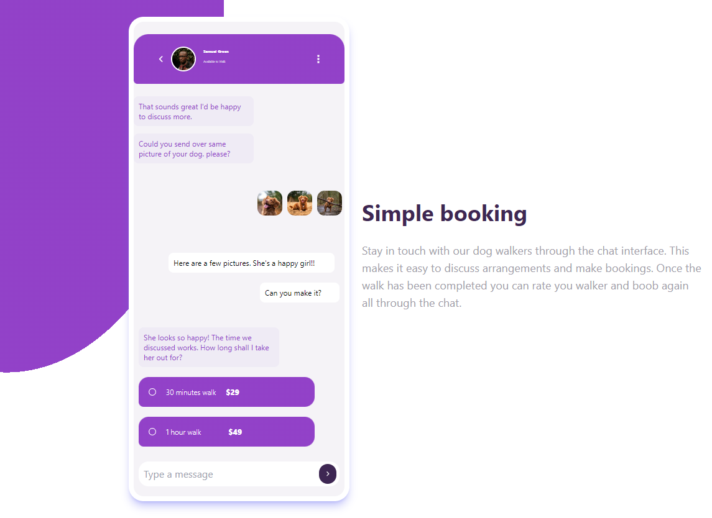

# Chat app CSS illustration solution

This is a solution to the [Chat app CSS illustration challenge ]

## Table of contents

- [The challenge](#the-challenge)
- [Screenshot](#screenshot)
- [Links](#links)
- [My process](#my-process)

  - [Built with](#built-with)
  - [What I learned](#what-i-learned)

  - [Continued development](#continued-development)
  - [Useful resources](#useful-resources)

- [Author](#author)
- [Acknowledgments](#acknowledgments)

### The challenge

Users should be able to:

- View the optimal layout for the component depending on their device's screen size
- **Bonus**: See the chat interface animate on the initial load.

### Screenshot

[]

### Links

- PERVIEW: [https://miron-silviu.github.io/chat-app-ilustrator/]

## My process

For this project I used html and tailwind . The project was created with mobile first and is fully responsive.

### Built with

- Semantic HTML5 markup
- Flexbox
- Mobile-first workflow

**Note: These are just examples. Delete this note and replace the list above with your own choices**

### What I learned

I learned how to use background gradient and for different types of devices.

### Built with

- Semantic HTML5 markup
- CSS custom properties
- Flexbox
- Mobile-first workflow

### What I learned

I was able to learn how to implement radial-gradient use it as background.
